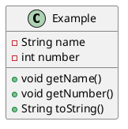

---
ceaf.change.adrs:
  dochub.adr_001:
    title: Выбор инструмента управления изменениями DocHub
    description: >
      С целью управления изменениями в DocHub необходимо было выбрать подход. В рамках анализа было принято решение управлять изменениями при помощи специального документа, который называется Architecture decision record (ADR)
    order: 1001    
    status: draft # draft; proposed; review; accepted; rejected
    date: 18.11.2024
    decision_level: product_team #product_team; several_teams
    doc_autor: https://t.me/i_frog_i
    # other_adr_links:
      # - <adr_link>
    desision_makers:
      - name: https://t.me/RPiontik
        role: Владелец продукта DocHub
      - name: https://t.me/i_frog_i
        role: Лидер CEAF
---

# "Здесь должно быть название ADR"
<!-- Название должно кратко формулировать решение.  -->

## Ссылки

<!-- Здесь добавлены ссылки (либо пусто):
1. на Родительский ADR(в Родительском ADR этой ссылки нет)
2. на Task в рамках которого происходит работа
3. на устаревший ADR, связанный с этим
4. ссылка на эпик из трэкера (Jira), в рамках которого принимается решение -->

## Контекст

<!-- Описание:

- причин, побудивших принять решение
- ограничений, действовавших на момент принятия решения
- проблемы, требующей решения -->

## Варианты решения

<!-- Описание рассмотренных вариантов.
Обязательно перечислить критерии сравнения альтернатив.
Пример критериев - соответствие принятым в компании архитектурным принципам (указать конкретные релевантные принципы).
Должно быть понятно, как критерии сравнения связаны с бизнес-приоритетами и драйверами из контекста. -->

## Вариант 1. Описание варианта
## Вариант 2. Описание варианта
<!-- ## Вариант 3. Описание варианта -->

## Решение

<!-- Описание выбранного решения.
Решение должно быть сформулировано чётко ("Мы используем...", "Мы не используем", а не "Желательно.." или "Предлагается...").
Должна быть понятна связь между решением и проблемой. -->

<!-- Если необходимо вставить диаграмму в формате plantump, необходимо использовать code block:

 -->

<!-- Для ADR, связанных с изменением техстека необходимо заполнить раздел Изменения техстека: -->

## Последствия

<!-- Положительные и отрицательные последствия (trade-offs). Арх. решения, которые потребуется принять как следствие принятого решения. Если решение содержит риски, то описано, как с ними планируют поступить (за счет чего снижать, почему принять).
 Арх. решения, которые потребуется принять как следствие принятого решения.
Если решение содержит риски, то описано, как с ними планируют поступить (за счет чего снижать, почему принять). -->
