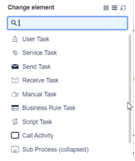
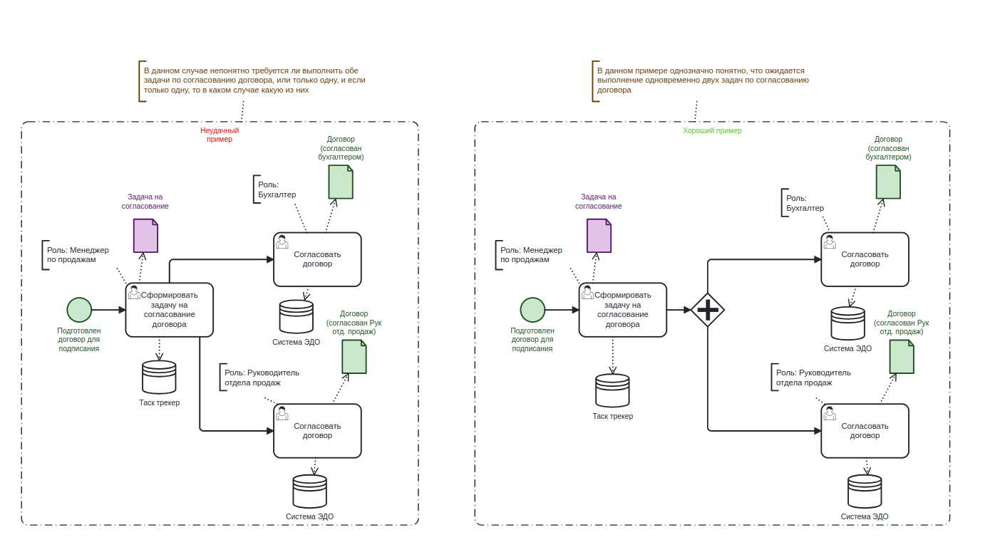
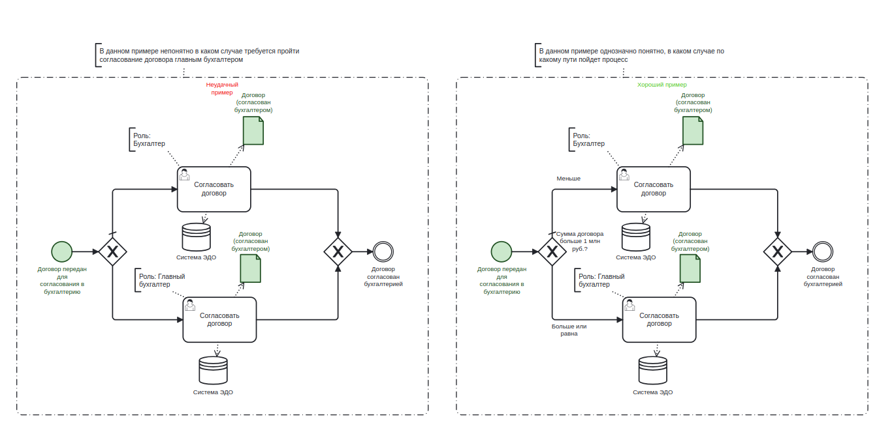
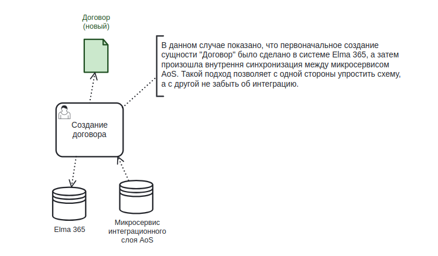
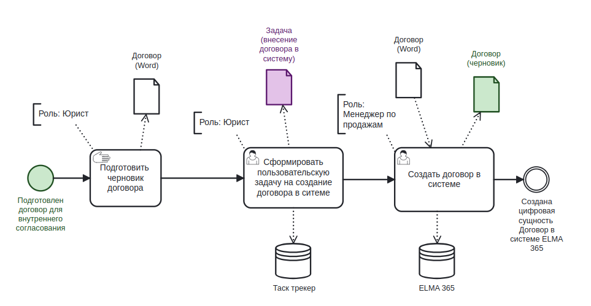
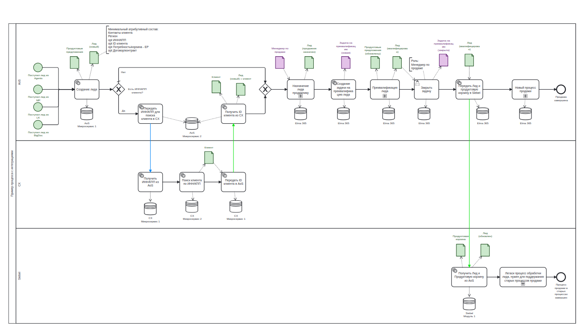

Методология описания бизнес-процессов (BDFD)

Предпосылки создания методологии
Корректное описание бизнес-процессов (БП) это ключ к правильной архитектуре систем, их надежности, масштабируемости и удовлетворённости конечных пользователей.

Вариант описания и гранулярность описываемых событий напрямую зависят от целей преследуемых автором. Существует множество вариантов как самого описания БП, так и нотаций используемых для этого. При этом популярные нотации обычно фокусируются на одном из разрезов, это либо описание для бизнес-пользователей, либо технические описания для ИТ-команд. В реальности жизнь сложнее и описание БП, с одной стороны должно быть понятным бизнес-пользователям, с другой стороны должно быть максимально информативным для ИТ-команд с точки зрения требований к системам и интеграциям.

Вторая важная цель описания БП, это самостоятельное получение информации о нем. Зачастую схемы БП рисуются так, что понять их без автора имеющего в голове контекст невозможно. Т.е. это означает, что полезность схемы описывающей БП сводиться к минимуму и ресурсы потраченные на неё командой затрачиваются неэффективно.

Для того чтобы решить эти проблемы мы объединили 2 нотации это BPMN 2.0 и DFD (Data Flow Diagram), что привело к появлению этой методологии, которую мы назвали Business and Data Flow Diagram.

Цели описания бизнес-процессов
Как было заявлено в предпосылках, ключ к успеху при описании БП является правильная идентификация целей этого описания.

В данной методологии цели были разделены на два типа:

Цели бизнеса - это цели операционного бизнеса по улучшению своих процессов. Такие команды зачастую называют RUN-командами.
Цели ИТ- здесь под ИТ понимаются команды способные полностью перестраивать существующие бизнес-процессы включая процессы реализованные внутри информационных систем, конечно при поддержке RUN-команд. Такие команды зачастую называют CHANGE-командами.
Таблица ниже описывает цели, команды к которым эта цель релевантная и обязательные пункты нотации, которые нужно выполнить, чтобы  полученная схема описания БП была понятной и достигала заявленной цели.Предпосылки создания методологии
Корректное описание бизнес-процессов (БП) это ключ к правильной архитектуре систем, их надежности, масштабируемости и удовлетворённости конечных пользователей.

Вариант описания и гранулярность описываемых событий напрямую зависят от целей преследуемых автором. Существует множество вариантов как самого описания БП, так и нотаций используемых для этого. При этом популярные нотации обычно фокусируются на одном из разрезов, это либо описание для бизнес-пользователей, либо технические описания для ИТ-команд. В реальности жизнь сложнее и описание БП, с одной стороны должно быть понятным бизнес-пользователям, с другой стороны должно быть максимально информативным для ИТ-команд с точки зрения требований к системам и интеграциям.

Вторая важная цель описания БП, это самостоятельное получение информации о нем. Зачастую схемы БП рисуются так, что понять их без автора имеющего в голове контекст невозможно. Т.е. это означает, что полезность схемы описывающей БП сводиться к минимуму и ресурсы потраченные на неё командой затрачиваются неэффективно.

Для того чтобы решить эти проблемы мы объединили 2 нотации это BPMN 2.0 и DFD (Data Flow Diagram), что привело к появлению этой методологии, которую мы назвали Business and Data Flow Diagram.

Цели описания бизнес-процессов
Как было заявлено в предпосылках, ключ к успеху при описании БП является правильная идентификация целей этого описания.

В данной методологии цели были разделены на два типа:

Цели бизнеса - это цели операционного бизнеса по улучшению своих процессов. Такие команды зачастую называют RUN-командами.
Цели ИТ- здесь под ИТ понимаются команды способные полностью перестраивать существующие бизнес-процессы включая процессы реализованные внутри информационных систем, конечно при поддержке RUN-команд. Такие команды зачастую называют CHANGE-командами.
Таблица ниже описывает цели, команды к которым эта цель релевантная и обязательные пункты нотации, которые нужно выполнить, чтобы  полученная схема описания БП была понятной и достигала заявленной цели.

ID

Точка зрения

Цель

Обязательные разделы нотации

1-1

Бизнес (RUN-команда)

Иметь единое понимание, как я должен работать для достижения своих целей

1 Наименование бизнес-процессов

2 Стартовое и конечное события

3 Описание задач (действий)

4 Описание работы со стрелками

1-2

Бизнес (RUN-команда)

Четко определить границы своей деятельности (чем я занимаюсь, и чем я не занимаюсь)

1 Наименование бизнес-процессов

2 Стартовое и конечное события

3 Описание задач (действий)

4 Описание работы со стрелками

1-3

Бизнес (RUN-команда)

Выявить соприкосновения (зависимости) с процессами смежных подразделений

1 Наименование бизнес-процессов

2 Стартовое и конечное события

3 Описание задач (действий)

4 Описание работы со стрелками

1-4

Бизнес (RUN-команда)

Как моя функция задействована/влияет на этапы сквозного процесса

1 Наименование бизнес-процессов

2 Стартовое и конечное события

3 Описание задач (действий)

4 Описание работы со стрелками

1-5

Бизнес (RUN-команда)

Определить требования и обязательства по взаимодействию со смежными подразделениями (предоставление информации, сроки и т.д.)

1 Наименование бизнес-процессов

2 Стартовое и конечное события

3 Описание задач (действий)

4 Описание работы со стрелками

1-6

Бизнес (RUN-команда)

Определить и зафиксировать функциональные обязанности своих сотрудников и SLA по их исполнению

1 Наименование бизнес-процессов

2 Стартовое и конечное события

3 Описание задач (действий)

4 Описание работы со стрелками

1-7

Бизнес (RUN-команда)

Понимать в каких ИТ-системах работают мои сотрудники

1 Наименование бизнес-процессов

2 Стартовое и конечное события

3 Описание задач (действий)

4 Описание работы со стрелками

1-8

Бизнес (RUN-команда)

Упростить адаптацию/обучение сотрудников

1 Наименование бизнес-процессов

2 Стартовое и конечное события

3 Описание задач (действий)

4 Описание работы со стрелками

1-9

Бизнес (RUN-команда)

Выявить неоптимальные/неэффективные участки процесса с целью их оптимизации

1 Наименование бизнес-процессов

2 Стартовое и конечное события

3 Описание задач (действий)

4 Описание работы со стрелками

2-1

ИТ (CHANGE-команда)

Видеть какие ИТ-команды вовлечены в реализацию данного процесса. 

1 Наименование бизнес-процессов

2 Стартовое и конечное события

3 Описание задач (действий)

4 Описание работы со стрелками

7 Использование дорожек для систем

2-2

ИТ (CHANGE-команда)

Видеть какие ИТ-системы используются в реализации данного процесса

1 Наименование бизнес-процессов

2 Стартовое и конечное события

3 Описание задач (действий)

4 Описание работы со стрелками

2-3

ИТ (CHANGE-команда)

Как моя система задействована в рамках сквозного процесса

1 Наименование бизнес-процессов

2 Стартовое и конечное события

3 Описание задач (действий)

4 Описание работы со стрелками

2-4

ИТ (CHANGE-команда)

Понимать, какие данные (бизнес-сущности) создаются, модифицируются, удаляются в рамках процесса

1 Наименование бизнес-процессов

2 Стартовое и конечное события

3 Описание задач (действий)

4 Описание работы со стрелками

5 Описание Бизнес-сущностей

2-5

ИТ (CHANGE-команда)

Понимать, какие события происходят/формируются в рамках процесса, и как они влияют на данные и ход процесса

1 Наименование бизнес-процессов

2 Стартовое и конечное события

3 Описание задач (действий)

4 Описание работы со стрелками

2-6

ИТ (CHANGE-команда)

Понимать зависимости между системами/трайбами/кластерами (интеграции между ИТ-системами, которые реализуются разными ИТ-командами)

1 Наименование бизнес-процессов

2 Стартовое и конечное события

3 Описание задач (действий)

4 Описание работы со стрелками

5 Описание Бизнес-сущностей

6 Требования к описанию интеграций между АС

7 Использование дорожек для систем

2-7

ИТ (CHANGE-команда)

Видеть интеграции между ИТ-системами в рамках одного трайба

1 Наименование бизнес-процессов

2 Стартовое и конечное события

3 Описание задач (действий)

4 Описание работы со стрелками

5 Описание Бизнес-сущностей

6 Требования к описанию интеграций между АС

2-8

ИТ (CHANGE-команда)

Видеть, какие бизнес-сущности являются цифровыми, а какие нет

1 Наименование бизнес-процессов

2 Стартовое и конечное события

3 Описание задач (действий)

4 Описание работы со стрелками

5 Описание Бизнес-сущностей

2-9

ИТ (CHANGE-команда)

Видеть, какие цифровые бизнес-сущности "живут" в одной ИТ-системе, а какие переходят из системы в систему

1 Наименование бизнес-процессов

2 Стартовое и конечное события

3 Описание задач (действий)

4 Описание работы со стрелками

5 Описание Бизнес-сущностей

6 Требования к описанию интеграций между АС

2-10

ИТ (CHANGE-команда)

Понимать, в каких интеграционных потоках передается бизнес-сущность или ее часть, а в каких события

1 Наименование бизнес-процессов

2 Стартовое и конечное события

3 Описание задач (действий)

4 Описание работы со стрелками

5 Описание Бизнес-сущностей

6 Требования к описанию интеграций между АС

2-11

ИТ (CHANGE-команда)

Упростить постановку задачи на доработку систем для ИТ-команд

1 Наименование бизнес-процессов

2 Стартовое и конечное события

3 Описание задач (действий)

4 Описание работы со стрелками

5 Описание Бизнес-сущностей

6 Требования к описанию интеграций между АС

7 Использование дорожек для систем

2-12

ИТ (CHANGE-команда)

Определить какие API-контракты должна реализовать каждая из вовлеченных ИТ-команд

1 Наименование бизнес-процессов

2 Стартовое и конечное события

3 Описание задач (действий)

4 Описание работы со стрелками

5 Описание Бизнес-сущностей

6 Требования к описанию интеграций между АС

7 Использование дорожек для систем

2-13

ИТ (CHANGE-команда)

Определить неоптимальную реализацию/отсутствие необходимого прикладного функционала или интеграций между системами

1 Наименование бизнес-процессов

2 Стартовое и конечное события

3 Описание задач (действий)

4 Описание работы со стрелками

5 Описание Бизнес-сущностей

6 Требования к описанию интеграций между АС

7 Использование дорожек для систем

Подход к методологии
За основу методологии взята нотация BPMN (Business Process Model and Notation) и идеи из нотации DFD (Data Flow Diagram).
Данная методология предназначена для логического описания процесса, а не исполняемого. Для исполняемых процессов требуется использовать стандартную нотацию BPMN.
Ключевые отличия предлагаемой методологии BDFD от стандартной BPMN:

в качестве дорожек в схеме используются не роли, а системы (группы систем). Это позволяет максимально эффективно управлять доработками каждой системы - команда, читая информацию по "своей" дорожке, получает задачи на разработку
введен новый тип стрелок - поток данных между системами и введены понятия "цифровая бизнес-сущность" и "нецифровая бизнес-сущность". Это позволяет командам быстро идентифицировать требования к интеграциям между системами

Требования к описанию бизнес-процессов
1. Наименование бизнес-процессов
В начале наименования бизнес-процесса должна быть метка [AS IS] или [TO BE]
Наименование бизнес-процесса должно быть кратким и отражать смысл этого процесса
Неудачный пример: "Процесс AoS"

Хороший пример: [TO BE] Целевой процесс управления продажами в продукте AoS на горизонт до 2026 года

Не нужно бояться делать длинное название БП,  главное чтобы человек не имеющий контекст сразу понял цель схемы и и важные детали, например такие такие как горизонт для схем TO BE.

2. Стартовое и конечное события
Каждый процесс должен иметь стартовое и конечное события, при этом для стартового события необходимо указать, что является бизнес-триггером, который запускает процесс. Под триггером мы понимаем бизнес-событие, которое произошло в реальном мире, и явилось причиной для старта экземпляра бизнес-процесса. Стартовое событие процесса обозначается зеленым цветом.

Пример

Пояснения примера:

Название стартового события "Рассчитать БК" для сотрудника вне контекста описываемого БП не содержит полезной информации, так как непонятно что такое БК, в каких случаях стартует данное событие и зачем оно выполняется в процессе. Правильно описанное событие и не только стартовое, это первый шаг к пониманию всего процесса, так как именно события задают локальные цели участков процесса. Зеленый цвет позволяет на сложных схемах быстро найти точки входа в процесс.

3. Описание задач (действий)
Любая задача, отраженная на схеме, должна соответствовать следующим требованиям:

гранулярность задачи (task) должна соответствовать действию, которое выполняет только одна роль. Если для выполнения задачи требуется несколько ролей (участников), то ее необходимо разделить на две, либо использовать подпроцесс. Например, действие "Согласовать договор" может содержать в себе подпроцесс маршрута согласования с более чем с одним участником, тогда требуется разделить эту задачу на несколько, соответствующих маршруту согласования, например, "Согласовать договор с бухгалтерией", "Согласовать договор с финансовым директором" и т.д.
должна быть указана роль для каждой задачи в процессе, даже если вы использовали дорожки, и в дорожках прописали участников.
если для выполнения задачи используются входные данные (документы), то эту информацию необходимо отразить на схеме, используя стандартный элемент нотации - Документ
в результате выполнения любой задачи должен быть результат: либо событие (-я), либо выходные данные (Документы)
из схемы всегда должно быть понятно в какой системе реализован функционал выполняемый конкретной задачей. Для этого к задаче должна быть добавлена система в виде стандартного элемента нотации BPMB - Система (бочонок)
помимо дополнительных атрибутов задачи, необходимо не забывать использовать стандартные элементы нотации BPMN для уточнения типа задачи:

Пример

4. Описание работы со стрелками
4.1. Управляющие стрелки в процессе
Обозначаются сплошной линией
Служат для соединения основных элементов процесса (события, задачи, шлюзы)
Нельзя делать более одной стрелки из задачи. Если вам требуется показать развилку в процессе, требуется использовать шлюз

Стрелки, выходящие из шлюзов ИЛИ, И/ИЛИ должны быть подписаны. В подписи к стрелкам должны быть указаны условия, однозначно дающие понимание в каком случае процесс движется по данному маршруту

Дополнительные стрелки
Обозначаются прерывистой линией
Если документ на схеме является результатом выполнения задачи, то стрелку необходимо нарисовать от задачи к документу (см. пример процесса выше)
Если для выполнения задачи требуются входные данные, то стрелку необходимо рисовать от документа к задаче (см. пример процесса выше)
Для отражения факта того, что задача выполняется в конкретной требуется рисовать стрелку от задачи к системе (бочонку). Если в рамках одного действия нужно показать взаимодействие между системами/сервисами одной команды, то  это можно сделать указав две системы у одной задачи где факт обмена информацией будет отражен стрелкой от системы к задаче

5. Описание Бизнес-сущностей
если задача выполняется с помощью систем, то результатом задачи в качестве выходного артефакта необходимо указать измененную цифровую бизнес-сущность. Для этого используется стандартный элемент нотации - Документ, с соответствующей заливкой фона:
зеленый цвет используется для цифровой бизнес-сущности, жизненный цикл которой реализован в нескольких системах.
фиолетовый цвет используется для цифровой сущности, жизненный цикл которой реализован только в одной системе
Такая цветовая градация позволяет эффективно проводить анализ неоптимальных участков процесса (например, одна и та же сущность дублируется в различных системах, а интеграция между системами отсутствует)  
если задача выполняется вне систем, то результатом выполнения данной задачи должна быть нецифровая бизнес-сущность. Нецифровую бизнес-сущность необходимо отображать на схеме, используя стандартный элемент нотации - Документ с белой заливкой фона

6. Требования к описанию интеграций между системами
Любая интеграция между системами должна описываться тремя компонентами: задача по передаче данных, поток интеграции, задача по получению данных
Задачи по передаче/получению данных должны помечаться маркером "автоматическая"
Задачи на передачу данных должны иметь описание того, какая цифровая бизнес-сущность или событие передается, и в какую систему
Задачи на получение данных должны иметь описание того, какая сущность или событие принимается, и из какой системы. В качестве результата получения требуется указывать, какая цифровая бизнес-сущность изменяется
Потоки интеграции между системами должны описываться цветными стрелками.
Зеленая стрелка - поток интеграции, передающий цифровую бизнес-сущность или ее часть
Синяя стрелка  - поток интеграции, передающий событие, например, поступление платежа по договору, получение выписки из банка
7. Использование дорожек для систем
Схема разделена на дорожки по принципу одна дорожка = одна система или группа систем, разрабатываемых одним кластером.

