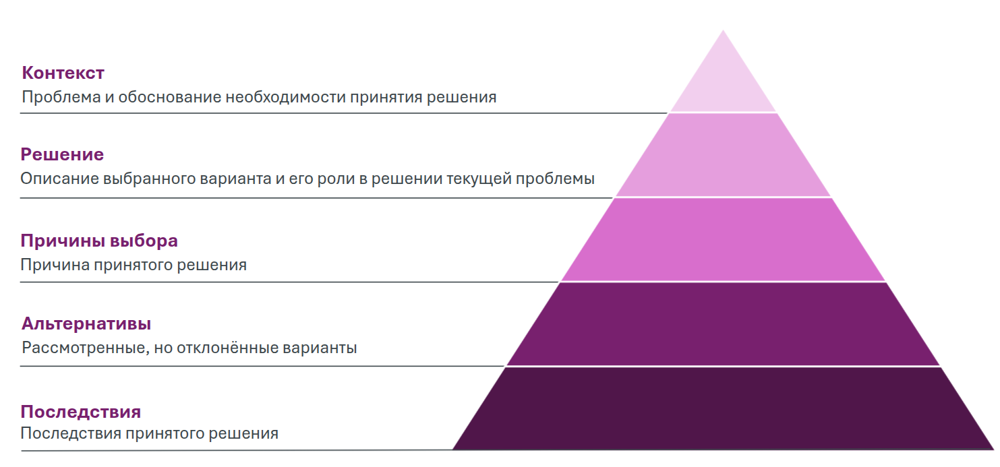
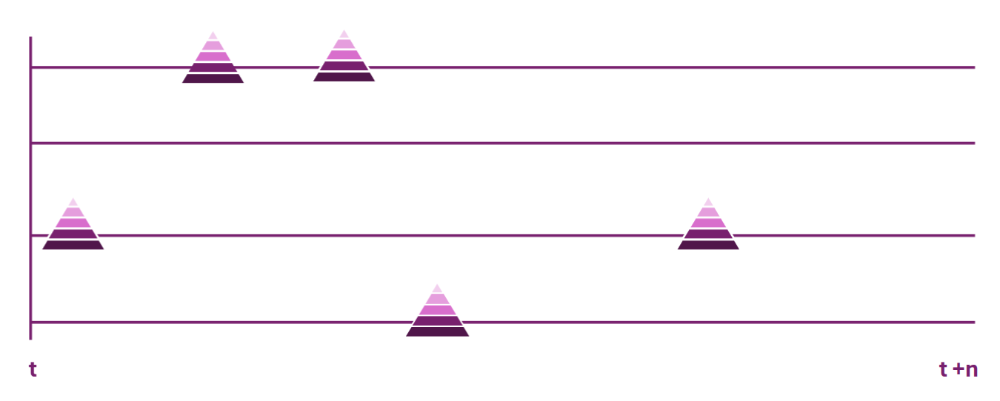
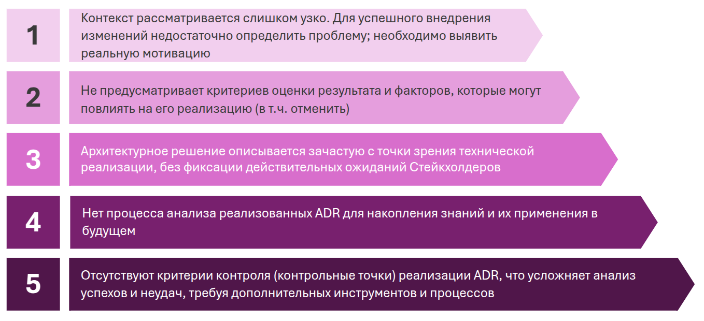
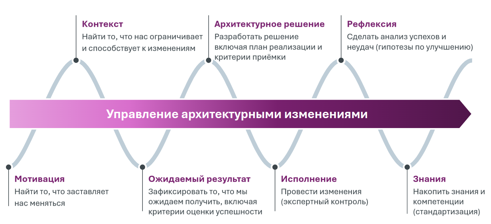
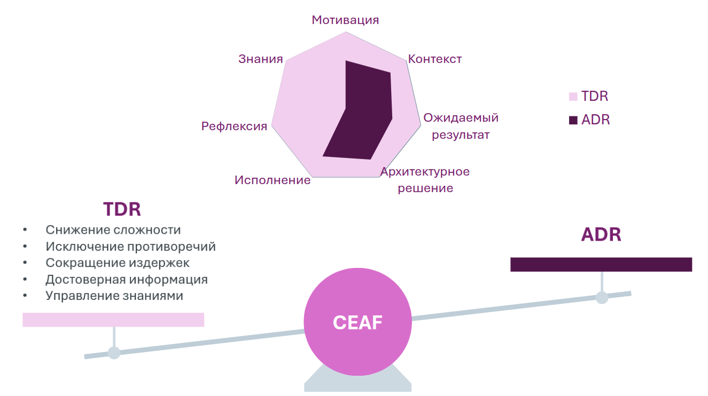

## Управление архитектурными решениями

### Что такое ADR и ADL

В классическом варианте для управления архитектурными решениями используется специальный документ, называемый **Architecture Decision Record (ADR)**.

ADR — это документ, фиксирующий важное архитектурное решение, принятое в контексте разработки, вместе с его причинами, последствиями и альтернативами. Например, в процессе разработки программного обеспечения возникает необходимость фиксировать решения, связанные с дизайном, проектированием, выбором инструментов или подходов, которые отвечают как функциональным, так и нефункциональным требованиям (например, производительности, масштабируемости или безопасности).

ADR обычно включает несколько ключевых разделов:

- **Контекст**: обоснование необходимости принятия решения.
- **Решение**: описание выбранного варианта и его роли в решении текущей проблемы.
- **Причины выбора**: обоснование принятого решения.
- **Альтернативы**: рассмотренные, но отклонённые варианты.
- **Последствия**: последствия принятого решения.

Для управления и отслеживания ADR используется **Architecture Decision Log (ADL)**. ADL — это журнал, в котором фиксируются все важные архитектурные решения, принятые в процессе разработки программного обеспечения. Его основная цель — предоставить историческую информацию о том, как и почему принимались те или иные решения, а также помочь в принятии обоснованных решений в будущем.

Вместе ADR и ADL создают структуру для принятия и отслеживания архитектурных решений, обеспечивая прозрачность, историческую последовательность и повышение качества проектирования системы.

### Почему классический ADR не подходит

В процессе анализа внедрения изменений в CEAF мы изучили отраслевые практики, включая подход управления через ADR, и пришли к выводу, что классический ADR не соответствует нашим требованиям по ряду причин:

1. **Узкий контекст**: контекст решения в ADR часто ограничивается техническими аспектами. Для успешного внедрения изменений необходимо учитывать мотивацию всех стейкхолдеров и стратегические цели.
2. **Отсутствие критериев оценки**: в ADR не предусмотрены критерии оценки результата или факторов, которые могут повлиять на реализацию решения, включая возможность его отмены.
3. **Технический уклон**: ADR преимущественно фокусируется на технической реализации, игнорируя ожидания и мотивацию стейкхолдеров.
4. **Отсутствие управления знаниями**: отсутствует процесс анализа уже реализованных ADR для накопления знаний и их применения в будущем.
5. **Нет контрольных точек**: в ADR отсутствуют критерии контроля реализации решений, что усложняет анализ успехов и неудач.

Таким образом, для управления изменениями в CEAF нам необходимо было адаптировать подход ADR под наш контекст, обеспечив более глубокую интеграцию с процессом управления изменениями.

### Что такое TDR

Чтобы избежать путаницы в терминологии, мы разработали инструмент под названием **Transformation Decision Record (TDR)**. В рамках CEAF TDR используется не только для фиксации архитектурных решений, но и для полного управления процессом изменений на всех этапах — от идеи до эксплуатации. Важно подчеркнуть, что TDR не заменяет ADR, а дополняет его: ADR являются частью TDR.

TDR интегрирует управление архитектурными решениями в единую систему, обеспечивая контроль над процессом изменений, минимизацию рисков и долгосрочную гибкость архитектуры. Принципиальное отличие TDR — управление знаниями, что позволяет систематически накапливать и использовать опыт для улучшения качества архитектурных решений.

### Процесс TDR

Процесс TDR состоит из следующих этапов:

1. **Определение мотивации**: необходимо выявить ключевого бенефициара изменений — основного стейкхолдера, для которого изменения имеют максимальную ценность. Без этого изменения нецелесообразны.
2. **Определение контекста**: анализируются все факторы, ограничивающие или способствующие изменениям, включая идентификацию всех стейкхолдеров.
3. **Формулировка ожидаемого результата**: фиксируются ожидаемые результаты, включая критерии оценки успешности.
4. **Формирование архитектурного решения**: разрабатывается решение, включая план реализации и критерии приёмки.
5. **Реализация архитектурного решения**: выполняются изменения и контролируется их корректность.
6. **Рефлексия**: анализируются успехи и неудачи, выявляются их причины, формируются гипотезы по улучшению процесса.
7. **Накопление знаний и компетенций**: фиксируются ключевые выводы и стандартизируются подходы для применения в будущем.

### Преимущества TDR

В настоящее время существует множество процессов для принятия архитектурных решений. Однако они часто дублируются, противоречат друг другу и находятся на разных этапах зрелости, что снижает качество внедрения архитектурных решений. 

В отличие от этих процессов, TDR обеспечивает:

- **Снижение сложности**: унификация процесса ускоряет принятие решений, улучшает их качество и устраняет дублирование документации.
- **Исключение противоречий**: устранение параллельных процессов минимизирует конфликты при реализации.
- **Сокращение издержек**: оптимизация управления процессами изменений снижает затраты.
- **Получение достоверной информации**: оперативная оценка текущего состояния позволяет быстрее адаптироваться к изменениям.
- **Эффективное управление знаниями**: систематическое накопление и использование знаний повышает качество решений.

В рамках CEAF использование TDR позволяет сократить количество документов, таких как:

- **Бизнес-требования (БТ)**,
- **Тактическая архитектура (ТАР)**,
- **Техническое задание (ТЗ)**,
- **Частное техническое задание (ЧТЗ)**.

Сосредоточение на одном логичном и последовательном процессе управления архитектурными решениями обеспечивает прозрачность, согласованность и поддержку всех заинтересованных сторон.

Применение TDR способствует долгосрочной гибкости архитектуры, её соответствию бизнес-требованиям и техническим условиям, а также повышает общую эффективность управления изменениями.

